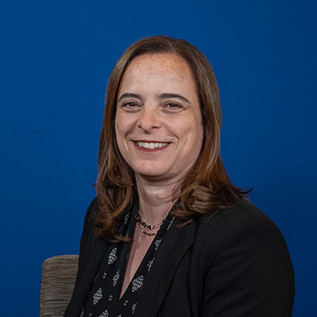
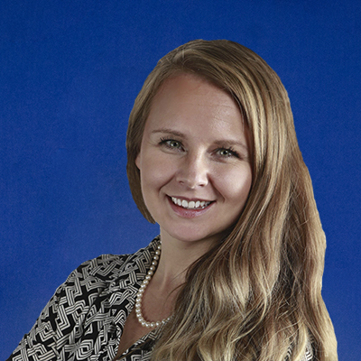
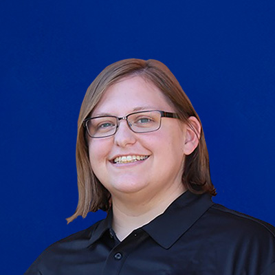
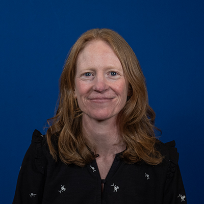
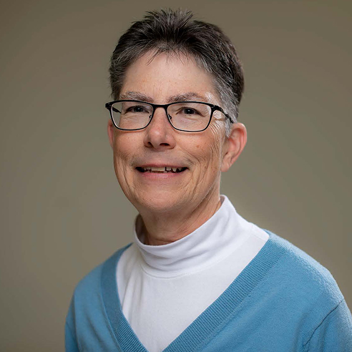

<h3 class="border-bottom border-1">Institute for Community Inclusion/University of Massachusetts</h3>
 

   

          

            
            

            <h5 class="card-title">Lara Enein - MA, CESP </h5>
              
Lara Enein is a Program Manager and the Director of the Maine Working Together Project. She is the coordinator of the Employment Services Program at the Institute for Community Inclusion (ICI) at the University of Massachusetts Boston (UMass Boston). She develops curricula for the DirectCourse College of Employment Services and for other projects. Lara is an approved Association of Community Rehabilitation Educators (ACRE) trainer and a member of the ACRE Board of Directors. Lara delivers presentations, technical assistance, and training to assist provider agencies, state agencies, and career centers to build their capacity to serve individuals with disabilities. 

            

          

      

       

          

               
            

                <h5 class="card-title">Brit Miles - CESP</h5>
              
Brit has worked for over 15 years as a direct support professional placing and coaching individuals who once worked in segregated, sub-minimum wage environments into real community jobs, applying Employment First beliefs, customized employment strategies, and person-centered principles. Brit facilitates training in best practices of competitive, integrated, employment for employment service providers, state agencies, and other stakeholders. Brit manages the project's Facebook page, supports the Maine Working Together website, and provides curricula and training.

            

          

      

        

          

            
            

             <h5 class="card-title">Kelly Wanzer - MS, CCC/SLP </h5>
              
Kelly is a Speech Language Pathologist with over 10 years of experience providing services to individuals with intellectual and developmental disabilities in a variety of settings. At the ICI, Kelly develops curricula, facilitates training, and provides technical assistance on various employment related initiatives geared toward enhancing inclusive practices for individuals with disabilities. For the Maine Working Together Project, Kelly develops curricula and provides training.

            

          

        

        

          

            
            

             <h5 class="card-title">Beth Wike - BS, MS
            </h5>
              
Beth has 20 years of experience working in the field of disability services. With a background in recreation therapy, Beth held various roles including direct service, program leadership, and adjunct instructor. At the ICI, Beth's professional focus is on capacity building. Beth develops and provides training and technical assistance on competitive integrated employment and community life engagement to disability service providers.  Prior to joining the ICI, Beth was Director of Disability Services and coordinated the Island Disability Coalition, a community coalition that identified and addressed the needs of people with disabilities and their families through a coalitional approach that fosters shared responsibility and creative problem solving. 
              

            

          

        

     <h3 class="border-bottom border-1">Center for Community Inclusion and Disability Studies/University of Maine</h3>
       

              

          

                  
            

                <h5 class="card-title">Janet May - MEd, MS, CRC</h5>
              
Janet is the Coordinator of Transition and Adults at the University of Maine Center for Community Inclusion and Disability Studies (CCIDS). Janet provides training on career exploration and competitive integrated employment to employment professionals, educators, and individuals with disabilities and their families. She is a member of Maine Association of People Supporting Employment First (APSE) and currently serves on the state board.

            

          

      

          

          

             
            

                <h5 class="card-title">Bonnie Robinson - MEd </h5>
              
Bonnie is a Research Associate at the CCIDS at the University of Maine. She assists with the creation, preparation, and dissemination of materials in accessible formats to meet the needs of multiple and diverse audiences. Bonnie also provides content management for the CCIDS website. Bonnie will be an administrator for the Maine College of Employment Supports on DirectCourse.

            

          

      

     

     