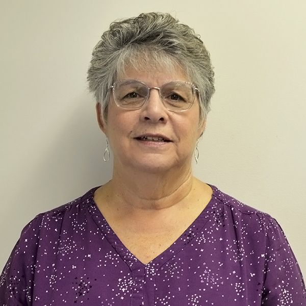

<h3 class="border-bottom border-1">Institute for Community Inclusion/University of Massachusetts</h3>
 

   

          

            
            

            <h5 class="card-title">Lara Enein, MA, CESP, ACRE </h5>
              
Lara Enein is a Program Manager and the Director of the Maine Working Together Project. She is the coordinator of the Employment Services Program at the Institute for Community Inclusion (ICI) at the University of Massachusetts Boston (UMass Boston). She develops curricula for the DirectCourse College of Employment Services and for other projects. Lara is an approved Association of Community Rehabilitation Educators (ACRE) trainer and a member of the ACRE Board of Directors. Lara delivers presentations, technical assistance, and training to assist provider agencies, state agencies, and career centers to build their capacity to serve individuals with disabilities. 

            

          

      

         

          

             
            

                <h5 class="card-title">Cecilia Gandolfo, MS, MEd, CESP </h5>
              
Cecilia is a Program Director at the ICI at UMass Boston and a trainer on this project. Cecilia develops curricula and delivers training and technical assistance on best practices in employment services, business engagement, and provider transformation. In Maine, she is known for her engaging delivery style of both ACRE and Progressive Employment training for community rehabilitation providers, VR staff, and educators. She is an approved ACRE trainer and served for over 10 years on the ACRE Board of Directors, including as the ACRE President.  

            

          

      

           

          

            
            

                <h5 class="card-title">David Hoff, MSW</h5>
              
David Hoff is a Program Director at the ICI at UMass Boston. In this role, he provides training and technical assistance to service providers and public agencies throughout the United States on advancing employment for individuals with disabilities, including presentations on a regular basis in Maine. In addition to his 25 years at ICI, David also has experience in direct service roles and as a workforce system administrator. He previously spent 10 years in management in the private sector.

            

          

      

       

          

               
            

                <h5 class="card-title">Brit Miles, CESP</h5>
              
Brit has worked for over 15 years as a direct support professional placing and coaching individuals who once worked in segregated, sub-minimum wage environments into real community jobs, applying Employment First beliefs, customized employment strategies, and person-centered principles. Brit facilitates training in best practices of competitive, integrated, employment for employment service providers, state agencies, and other stakeholders. Brit manages the project's Facebook page, supports the Maine Working Together website, and provides curricula and training.

            

          

      

        

          

            
            

                <h5 class="card-title">Kelly Wanzer, MS, CCC/SLP </h5>
              
Kelly is a Speech Language Pathologist with over 10 years of experience providing services to individuals with intellectual and developmental disabilities in a variety of settings. At the ICI, Kelly develops curricula, facilitates training, and provides technical assistance on various employment related initiatives geared toward enhancing inclusive practices for individuals with disabilities. For the Maine Working Together Project, Kelly develops curricula and provides training.

            

          

        

     <h3 class="border-bottom border-1">Center for Community Inclusion and Disability Studies/University of Maine</h3>
       

              

          

                  
            

                <h5 class="card-title">Janet May, MEd, MS, CRC</h5>
              
Janet is the Coordinator of Transition and Adults at the University of Maine Center for Community Inclusion and Disability Studies (CCIDS). Janet provides training on career exploration and competitive integrated employment to employment professionals, educators, and individuals with disabilities and their families. She is a member of Maine Association of People Supporting Employment First (APSE) and currently serves on the state board.

            

          

      

              

          

              
            

                <h5 class="card-title">Gina Oswald, PhD</h5>
              
Gina brings over 20 years of experience across employment, vocational rehabilitation, and professional development pedagogy as a Senior Extension Associate supporting the Vocational Rehabilitation – Training, Education, and Development (VR-TED) project and NYS Consortium for Advancing and Supporting Employment (CASE) project at the K. Lisa Yang and Hock E. Tan Institute on Employment and Disability. Her career has included experience at the local, state, and national levels through the direct provision of vocational habilitation and rehabilitation services in Ohio, professional development of preservice and current practitioners across the country, and leadership at the national level in rehabilitation organizations. 

            

          

      

          

          

             
            

                <h5 class="card-title">Bonnie Robinson, MEd </h5>
              
Bonnie is a Research Associate at the CCIDS at the University of Maine. She assists with the creation, preparation, and dissemination of materials in accessible formats to meet the needs of multiple and diverse audiences. Bonnie also provides content management for the CCIDS website. Bonnie will be an administrator for the Maine College of Employment Supports on DirectCourse.

            

          

      

      

          

           
            

                <h5 class="card-title">Josh Taylor, PhD </h5>
              
Josh is an Assistant Professor of Special Education in the College of Education and Human Development at the University of Maine. His research focuses on promoting lifelong success for individuals with autism and developmental disabilities through implementation of evidence-based practices in inclusive school, work, and community settings. He earned a PhD in special education from Virginia Commonwealth University with a focus on research-to-policy implementation, and a Master of Education from the University of Virginia. Josh has promoted improved outcomes for people with disabilities in education and employment for over 10 years. Josh delivers presentations and training to assist stakeholders across Maine and the US to improve outcomes for individuals with disabilities. 

            

          

      

     

     